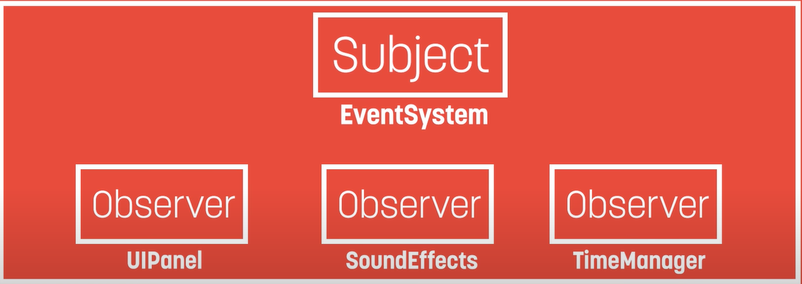

>💡 Start your game dev journey by sharing with the world and start earning reward points. Outscal team will give a special surprise reward to those who successfully complete this #30DaysGameDevChallenge
>
>Log in to LinkedIn.
Create a post.
Share a short post that you are starting the second chapter of your game development journey with below hashtags.
Tag Outscal and your newly made connections in the post so the team will get notified every time. Use #30DaysGameDevChallenge and #outscal in the post. final step. Submit the LinkedIn post link via this form https://airtable.com/shrXGSkgf5NClpoIU
💡 In this chapter, you can create two submissions.
>
>submission = 50 points
submissions = 100 points
500 points = Outscal Branded T-shirt 👕
>
---
## 1. What is Observer Pattern
An object (a.k.a Subject) maintains a list of its dependents known as observers. Then if a state is changed, the subject notifies all of its observers of changes usually by calling their methods.

The Observer pattern can also be defined as the relationship where one subject can signal its many watchers (or observers). Unintuitively, it is the subject calls out to its observers that respond, rather than the observers acting independently on the subject.

>💡 🚀 **[Join Discord Server](https://discord.gg/J5zDscnzms) → Get your doubts solved by experts instantly**
