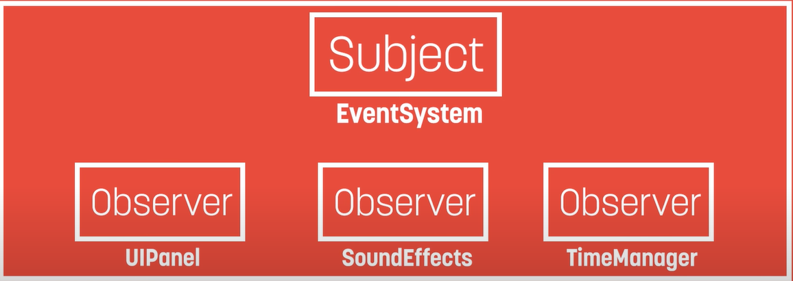

## What is Observer Pattern
An object (a.k.a Subject) maintains a list of its dependents known as observers. Then if a state is changed, the subject notifies all of its observers of changes usually by calling their methods.

The Observer pattern can also be defined as the relationship where one subject can signal its many watchers (or observers). Unintuitively, it is the subject calls out to its observers that respond, rather than the observers acting independently on the subject.
