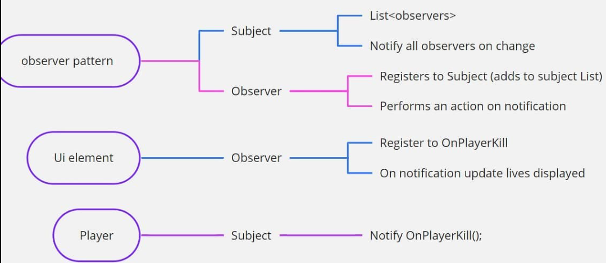

## How does Observer Pattern work
Observer Pattern follows one to many relationship which is explained below,

For example, in your game there is an instance when the player dies and after that elements changes dynamically such as health bar is 0, death animation, game freezes, enemy win animation etc. In order to accomplish all this, with the help of Observer Pattern we can, 

1. Using Subject we can broadcast the message that player is killed 
2. Any object/observer can choose to listen/subscribe to the event
3. The list of Objects/Observers may something based on the message

Below flow diagram gives you the visual representation what has been explained above

