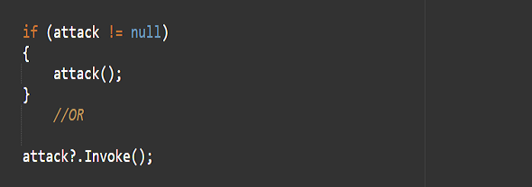

## What are Delegates
Delegates are nothing but function containers. Delegates allow us to store and call a function just like a variable. To do that, however, you have to decide which and what type of function, the delegate will be able to hold.

For example - You can define a delegate that has a return type as void, which means that it will not return anything, and that doesn’t take any parameters.

We usually write a normal function like this:

But to define a Delegate, you have to add the delegate keyword and remove the function’s body. like this:

This is a reference for a type of delegate. It defines what function can be stored in delegate instances.

In order to use it, you have to declare an instance of that delegate type.
Like this:

Now the attack delegate will hold any function, but that function should have a void return type and doesn't have any parameters.

In order to assign a function to the delegate, you just have to assign it in the same way as assigning a variable. All you need to do is pass in the name of the function, without parenthesis.
Like this:

It is important to only call a delegate if there’s a function assigned to it, otherwise, it will cause a null reference error. You can do it in two ways -

In the above example attack = PrimaryAttack; Here the delegate is called a single-cast delegate.

**? operator** - Responsible for the null check, because if the delegate is invoked and there are no subscribes then there it will cause an error in the program. (We can also check the same using IF statement as well)

Delegates can also work as Multicast Delegates which means that, instead of triggering only one function, they can be used to trigger multiple functions all data once.
Like this:

Here, both PrimaryAttack and SecondaryAttack will be called when the attack delegate is triggered.

**You can subscribe to the function using +=.** 

Subscribing creates a connection between two scripts, and it is extremely important to unsubscribe the function if it is no longer needed. You can **Unsubscribe the function by using -=.** 

This is important, as subscribing functions without cleaning them up afterwards can cause memory leaks.

## Drawback of delegates:

As delegates are public, other scripts can access the delegate, it is possible for any other script to call it or even clear the assigned functions from the delegate.
In order to prevent it, we have Events in unity.

>💡 🚀 **[Join Discord Server](https://discord.gg/J5zDscnzms) → Get your doubts solved by experts instantly**
