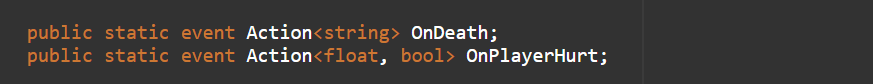

## What are Actions
Actions are nothing but ready-made delegates. They can be used to create a delegate or delegate event with a void return type.

In order to use an Action, you have to write **using System** directive on the top of your script.

You can create an action like this:

Actions have a void return type but they can be used with one or more parameters.

You can add parameters in angled brackets when declaring an action.

Like this:

>💡 🚀 **[Join Discord Server](https://discord.gg/J5zDscnzms) → Get your doubts solved by experts instantly**
