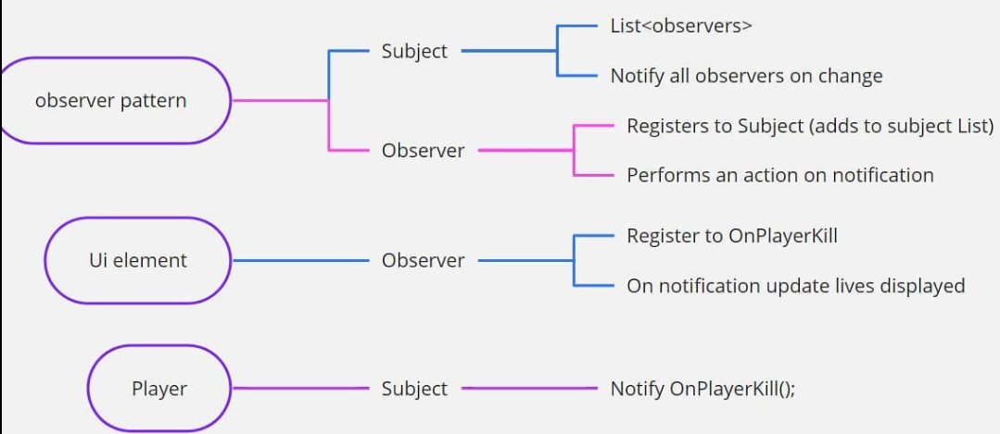

>💡 Start your game dev journey by sharing with the world and start earning reward points. Outscal team will give a special surprise reward to those who successfully complete this #30DaysGameDevChallenge
>
>Log in to LinkedIn.
Create a post.
Share a short post that you are starting the second chapter of your game development journey with below hashtags.
Tag Outscal and your newly made connections in the post so the team will get notified every time. Use #30DaysGameDevChallenge and #outscal in the post. final step. Submit the LinkedIn post link via this form https://airtable.com/shrXGSkgf5NClpoIU
💡 In this chapter, you can create two submissions.
>
>submission = 50 points
submissions = 100 points
500 points = Outscal Branded T-shirt 👕
>
---
## How does Observer Pattern work
Observer Pattern follows one to many relationship which is explained below,

For example, in your game there is an instance when the player dies and after that elements changes dynamically such as health bar is 0, death animation, game freezes, enemy win animation etc. In order to accomplish all this, with the help of Observer Pattern we can, 

1. Using Subject we can broadcast the message that player is killed 
2. Any object/observer can choose to listen/subscribe to the event
3. The list of Objects/Observers may something based on the message

Below flow diagram gives you the visual representation what has been explained above

>💡 🚀 **[Join Discord Server](https://discord.gg/J5zDscnzms) → Get your doubts solved by experts instantly**
