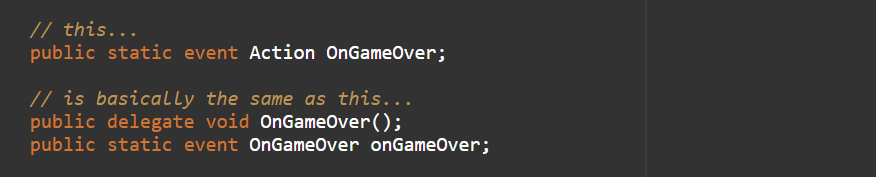
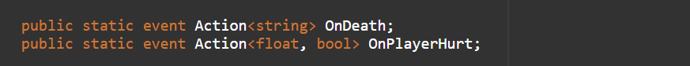

>💡 Start your game dev journey by sharing with the world and start earning reward points. Outscal team will give a special surprise reward to those who successfully complete this #30DaysGameDevChallenge
>
>Log in to LinkedIn.
Create a post.
Share a short post that you are starting the second chapter of your game development journey with below hashtags.
Tag Outscal and your newly made connections in the post so the team will get notified every time. Use #30DaysGameDevChallenge and #outscal in the post. final step. Submit the LinkedIn post link via this form https://airtable.com/shrXGSkgf5NClpoIU
💡 In this chapter, you can create two submissions.
>
>submission = 50 points
submissions = 100 points
500 points = Outscal Branded T-shirt 👕
>
---
## What are Actions
Actions are nothing but ready-made delegates. They can be used to create a delegate or delegate event with a void return type.

In order to use an Action, you have to write **using System** directive on the top of your script.

You can create an action like this:

Actions have a void return type but they can be used with one or more parameters.

You can add parameters in angled brackets when declaring an action.

Like this:

>💡 🚀 **[Join Discord Server](https://discord.gg/J5zDscnzms) → Get your doubts solved by experts instantly**
