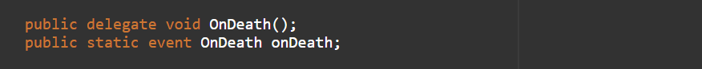

>💡 Start your game dev journey by sharing with the world and start earning reward points. Outscal team will give a special surprise reward to those who successfully complete this #30DaysGameDevChallenge
>
>Log in to LinkedIn.
Create a post.
Share a short post that you are starting the second chapter of your game development journey with below hashtags.
Tag Outscal and your newly made connections in the post so the team will get notified every time. Use #30DaysGameDevChallenge and #outscal in the post. final step. Submit the LinkedIn post link via this form https://airtable.com/shrXGSkgf5NClpoIU
💡 In this chapter, you can create two submissions.
>
>submission = 50 points
submissions = 100 points
500 points = Outscal Branded T-shirt 👕
>
---
## What are Events
Events are a special kind of multicast delegate and they work the same as normal delegates.

However, as delegates can be called by other scripts, event delegates can only be called from within the scripts. This means that they can subscribe and unsubscribe to their own functions but they cannot trigger the events or change the subscription of other functions from other classes.

To use events you’ll need to define a delegate type and an instance, just like when setting up a normal delegate. But instead of the delegate keyword, you have to add the event keyword.

Like this-

Using these event delegates it is easy to manage complex relationships between different behaviours in the game.
However, it is sometimes difficult to declare a new delegate type every time you want to use one.
In order to prevent it, Actions come in handy.

**Benefits of using Events,**

1. Overriding subscribed functions
2. Public invoking

>💡 🚀 **[Join Discord Server](https://discord.gg/J5zDscnzms) → Get your doubts solved by experts instantly**
